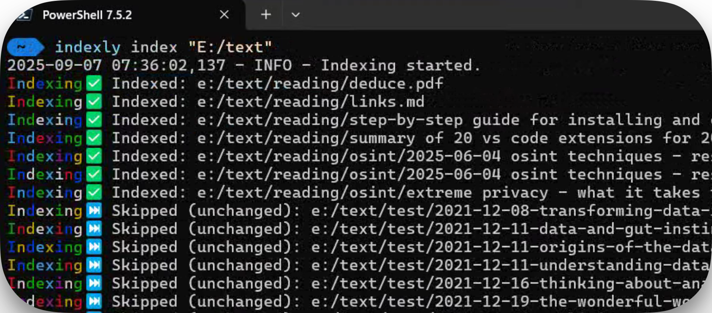
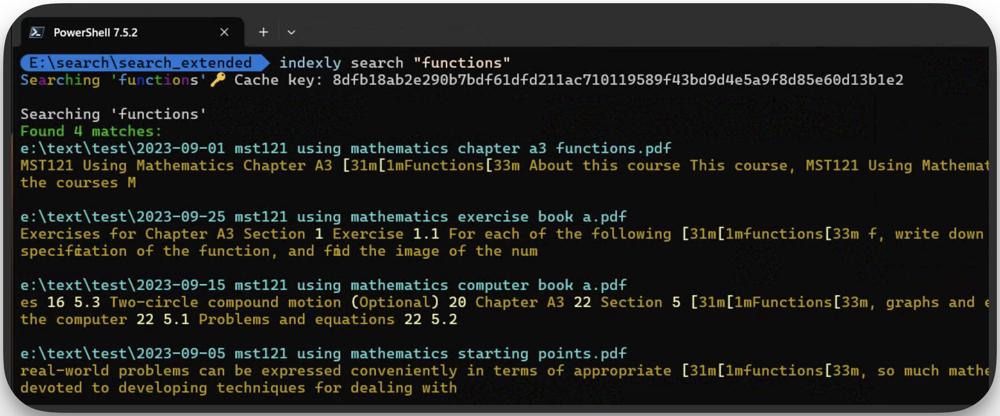

# 🔍 Project Indexly
**Blazing-fast Local File Search Tool with SQLite FTS5, Tagging, and Export**

> Privacy-first, offline file search made elegant.

---


---

## 🚀 Overview
**Project Indexly** is a lightweight Python-powered tool that indexes local files into an SQLite FTS5 database with support for:

- Full-text search  
- Tagging  
- Metadata filtering  
- Export (CSV/Markdown/JSON)  

Designed to work **100% offline**, it’s perfect for researchers, writers, developers, and digital organizers.

---

## ✨ Key Features

- 🔍 **Blazing-fast search** via SQLite FTS5  
- 🏷️ Tagging & custom metadata support  
- 📁 File-type detection with MIME parsing  
- 📤 Export to CSV, Markdown, JSON  
- 🔁 Smart re-indexing with `watchdog`  
- 📊 CLI preview of search results  
- 🔒 Privacy-first: no data leaves your machine  
- 🧠 Caches recently used queries  
- 🛠️ Configurable via `.env` or CLI flags  

---

## 📸 Screenshots

| Indexing Files | Search Preview |
|----------------|----------------|
|  |  |

---

## 📦 Installation

```bash
git clone https://github.com/kimsgent/project-indexly.git
cd project-indexly
python3 -m venv venv
source venv/bin/activate
pip install -r requirements.txt
````

---

## ⚙️ Usage Examples

### 🔍 Indexing a Folder

```bash
indexly index /path/to/folder
```

### 🧠 Searching Files

```bash
indexly search "project OR report"
```

### 🏷️ Tagging and Metadata

```bash
indexly tag add --files /path/to/file --tags archive invoice
```

### 📤 Exporting Results

```bash
indexly search --export-format json --output result.json
```

---

## 📁 Supported File Types

| Type    | Notes                 |
| ------- | --------------------- |
| `.txt`  | Full-text indexed     |
| `.md`   | Markdown supported    |
| `.pdf`  | (Coming soon)         |
| `.html` | Stripped and indexed  |
| `.csv`  | Header-aware indexing |
| Others  | Filtered by MIME type |

---

## 🧱 Project Structure

```text
project-indexly/
├── indexly/                # Main package
│   ├── core/               # Core logic
│   ├── cli/                # CLI commands
│   ├── utils/              # Helpers and utilities
│   ├── exports/            # Export formats
│   ├── config/             # Env settings and constants
│   └── templates/          # Markdown/HTML templates
├── docs/                   # Hugo site (documentation)
├── scripts/                # Utility scripts
├── tests/                  # Test suite
├── LICENSE.txt
├── pyproject.toml
├── requirements.txt
└── README.md
```

---

## 🔐 Technical Notes

* SQLite FTS5 full-text indexing
* MIME detection via `python-magic`
* Cross-platform path handling
* Environment variables via `python-dotenv`
* `watchdog` support for live indexing (optional)

---

## 🛣️ Roadmap

* [x] FTS5-based search
* [x] Tagging support
* [x] Export in multiple formats
* [x] PDF parsing and indexing
* [ ] GUI interface
* [ ] Web interface (optional self-hosted)

---

## 📚 Documentation

Full usage, configuration, and integration guides:
👉 [Project Indexly Docs](https://projectindexly.com)

---

## 🧑‍💻 Contributing

Contributions are welcome!
Please check [CONTRIBUTING.md](./CONTRIBUTING.md) before submitting pull requests.
👉 [Project Indexly on GitHub](https://github.com/kimsgent/project-indexly)

---

## 📬 Contact & Support

📩 Contact Page
✉️ Email: gentkims@gmail.com

---

## 👨‍💻 Author

**N. K Franklin-Gent**
Built with 💻, ☕, and 💡 in Dieburg, Germany.

Co-created with **ChatGPT** 🤝

---

## 📝 License

This project is licensed under the **MIT License** — see [LICENSE](./LICENSE.txt) for details.

