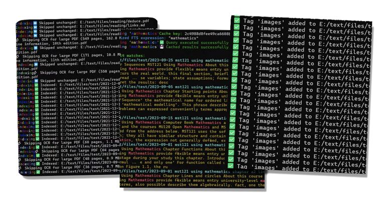

# Indexly

Local-first file indexing, search, and analysis CLI for Windows, macOS, and Linux.

[](https://pypi.org/project/indexly/)
[](https://pypi.org/project/indexly/)
[](LICENSE.txt)



## Why Indexly

Indexly helps you work with large local folders without sending your data to external services.

- Fast full-text search powered by SQLite FTS5
- Regex search when you need exact pattern matching
- Smart indexing with incremental updates and watch mode
- Built-in tagging and filtering for better organization
- Analysis tools for CSV, JSON, XML, SQLite, and more
- File and folder compare workflows
- Backup and restore commands for safer operations
- Cross-platform command line interface with readable output

## Install

### Option 1: pip (Windows, macOS, Linux)

```bash
python -m pip install --upgrade pip
python -m pip install indexly
```

Verify:

```bash
indexly --version
```

### Option 2: Homebrew (macOS and Linux)

```bash
brew tap kimsgent/indexly
brew install indexly
```

Verify:

```bash
indexly --version
```

## Optional Feature Packs

Indexly installs with a lightweight core by default. Optional capabilities are grouped as extras.

```bash
python -m pip install "indexly[documents]"
python -m pip install "indexly[analysis]"
python -m pip install "indexly[visualization]"
python -m pip install "indexly[pdf_export]"
```

Install all optional packs:

```bash
python -m pip install "indexly[documents,analysis,visualization,pdf_export]"
```

## First Run in 2 Minutes

### 1. Index a folder

```bash
indexly index /path/to/folder
```

### 2. Search your data

```bash
indexly search "invoice OR contract"
```

### 3. Run regex search

```bash
indexly regex "[A-Z]{3}-\\d{4}"
```

### 4. Add tags for filtering

```bash
indexly tag add --files "/path/to/file.txt" --tags urgent finance
```

### 5. Analyze CSV (requires analysis extra)

```bash
indexly analyze-csv sales.csv --show-summary
```

## Common Commands

```bash
indexly --help
indexly show-help
indexly index /path/to/folder
indexly search "keyword"
indexly watch /path/to/folder
indexly analyze-file /path/to/file
indexly compare path_a path_b
indexly backup /path/to/folder
indexly restore backup_name --target /restore/path
indexly doctor
```

## Supported Content (Highlights)

- Text and Markdown
- CSV, JSON/NDJSON, XML, YAML
- SQLite databases
- Spreadsheet and document formats via optional extras
- PDF and image workflows via optional extras

## For Developers

### Local setup

```bash
git clone https://github.com/kimsgent/project-indexly.git
cd project-indexly
python -m venv .venv
```

Activate virtual environment:

- macOS/Linux: `source .venv/bin/activate`
- Windows (PowerShell): `.venv\Scripts\Activate.ps1`

Install in editable mode with optional packs:

```bash
python -m pip install --upgrade pip
python -m pip install -e ".[documents,analysis,visualization,pdf_export]"
python -m pip install pytest pytest-cov flake8 black isort mypy build twine
```

Run quick checks:

```bash
indexly --help
pytest -q
```

## Troubleshooting

- If `indexly` is not found, restart your terminal after installation.
- If a feature is missing, install its extra group, for example `indexly[analysis]` or `indexly[documents]`.
- If Homebrew commands are unavailable on Linux, initialize brew shell environment first.
- Run `indexly doctor` for a quick environment health check.

## Documentation and Links

- Documentation: [projectindexly.com](https://projectindexly.com)
- Source code: [github.com/kimsgent/project-indexly](https://github.com/kimsgent/project-indexly)
- PyPI package: [pypi.org/project/indexly](https://pypi.org/project/indexly/)
- Issues: [github.com/kimsgent/project-indexly/issues](https://github.com/kimsgent/project-indexly/issues)

## License

MIT. See [LICENSE.txt](LICENSE.txt).
