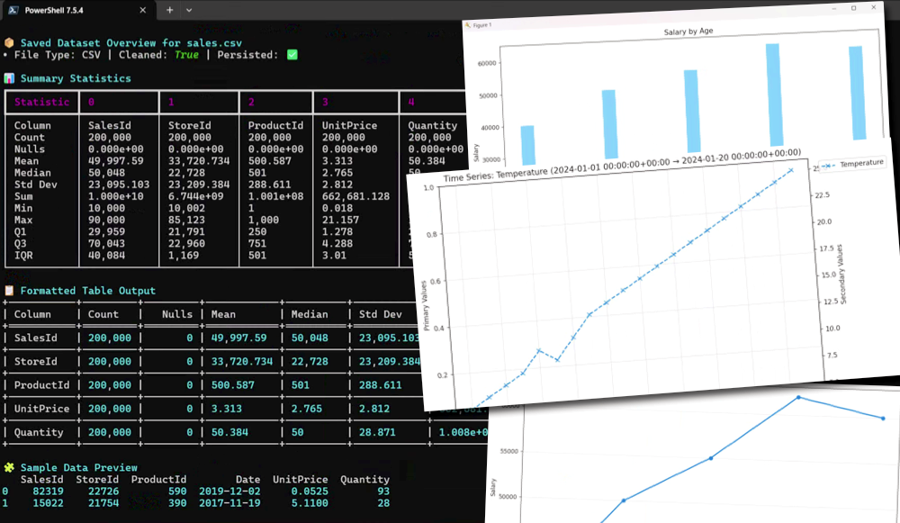

# 🔍 Project Indexly

**Blazing-fast Local File Search Tool with SQLite FTS5, Tagging & Advanced Analysis**

> Privacy-first, offline file search made elegant.

---


---

## 🚀 Overview

**Project Indexly** is a high-performance local file search and analysis tool powered by SQLite FTS5. It indexes your files, enriches them with metadata, and lets you search, tag, analyze, and export results efficiently — all **100% offline**.

Ideal for developers, researchers, writers, analysts, and anyone who works with large document collections.

---

## ✨ Key Features

* ⚡ **Fast full-text search** using FTS5
* 📁 Smart file-type detection (TXT, MD, CSV, XML, JSON, images & more)
* 🧠 **Advanced CSV & JSON analysis**
* 🕒 **Time-series visualization (CSV)**
* 🏷️ Tag management
* 📤 Export to CSV, Markdown, JSON
* 🔁 Real-time reindexing (optional)
* 🔒 Zero network calls — full privacy
* 🗂️ Rich metadata extraction (documents & images)
* 🎨 Colorized CLI output

---

## 📸 Screenshot

| Demo Preview                                               |
| ---------------------------------------------------------- |
|  |

---

## 📦 Installation

```bash
git clone https://github.com/kimsgent/project-indexly.git
cd project-indexly
python3 -m venv venv
source venv/bin/activate
pip install -r requirements.txt
```

---

## ⚙️ Usage Examples

### 🔍 Index files

```bash
indexly index /path/to/folder
```

### 🧠 Search

```bash
indexly search "report OR analysis"
```

### 🏷️ Add tags

```bash
indexly tag add --files notes.txt --tags project meeting
```

### 📤 Export results

```bash
indexly search "invoice" --export-format csv --output invoices.csv
```

### 📊 Analyze CSV (summary + time-series)

```bash
indexly analyze-csv data.csv --auto-clean --show-summary
```

---

## 📁 Supported File Types

| Type    | Notes                    |
| ------- | ------------------------ |
| `.txt`  | Full-text indexed        |
| `.md`   | Markdown supported       |
| `.csv`  | Header-aware, analyzable |
| `.json` | NDJSON + structured JSON |
| `.xml`  | Structured tree analysis |
| Images  | Metadata extracted       |
| Others  | MIME-based detection     |

---

## 🧱 Project Structure

```text
indexly/
├── core/
├── cli/
├── utils/
├── analysis/
├── exports/
├── docs/
└── tests/
```

---

## 🛣️ Roadmap

* [x] CSV & JSON analyzers
* [x] Time-series visualization
* [ ] GUI
* [ ] Self-hosted web dashboard

---

## 📚 Documentation

👉 *“Project Indexly Docs”* — [https://projectindexly.com](https://projectindexly.com)

---

## 📬 Contact

✉️ [gentkims@gmail.com](mailto:gentkims@gmail.com)

---

## 👨‍💻 Author

**N. K Franklin-Gent** — built in Dieburg, Germany.
Co-created with ChatGPT 🤝

---

## 📝 License

MIT — see `LICENSE.txt`.
