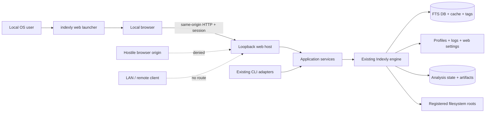
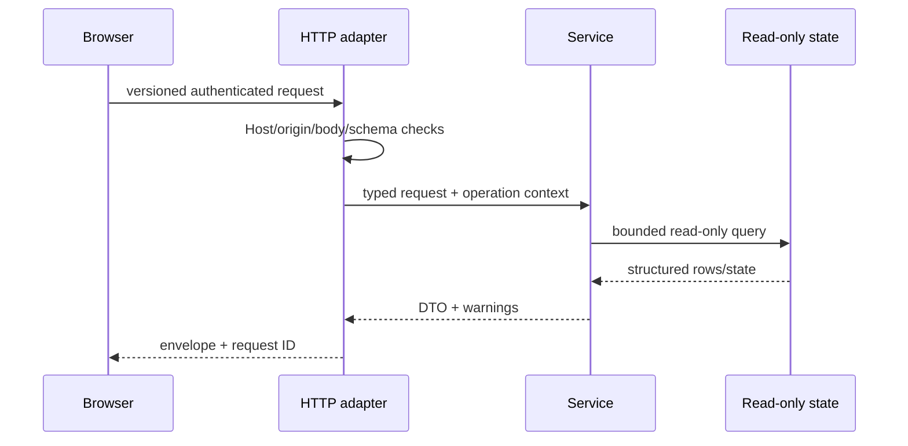
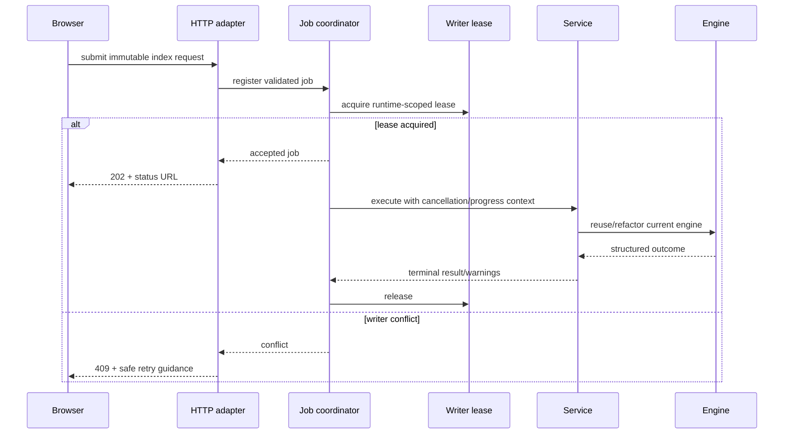

# Local web UI system architecture

> **Authority:** normative architecture after Phase 1 approval
> **Volatility:** low
> **State:** target architecture; the current repository has no web host,
> HTTP API, shared application-service layer, general job coordinator, or web
> settings store

The local web UI is an additive adapter around the existing Indexly engine. It
must make existing behavior easier to use without turning terminal output,
browser state, or HTTP details into new sources of domain truth. Candidate
technology and lifecycle choices are recorded in
[decisions.md](decisions.md); observable rules are defined in
[contracts.md](contracts.md).

## Context and trust boundary

Inside the machine does not mean trusted. Browser origins, local processes,
indexed content, filenames, metadata, tags, persisted JSON, SQLite content, and
external-tool output can all be malformed or hostile. The authenticated
same-origin HTTP boundary and registered-root service boundary are explicit
trust transitions.

## Current system evidence

The following is verified on the reviewed branch baseline and is not itself a
future API promise:

- `indexly.__main__.main` performs early performance and rename-watch-status
  routing, activates installed extras, then enters `indexly.indexly.main`.
- `cli_utils.build_parser` owns the broad CLI grammar; handlers in `indexly.py`
  still mix orchestration and terminal presentation.
- `scan_and_index_files` is asynchronous internally and uses a process-local
  lock, but `handle_index` is a synchronous CLI adapter.
- `search_core.search_fts5` and `search_regex` return result dictionaries but
  also print, own cache behavior, and currently retrieve unbounded matching
  rows before terminal presentation pagination.
- FTS cache validity includes `search_index_generation`; indexing advances the
  generation after effective content change or stale-row pruning.
- `db_utils.connect_db` creates parent state and initializes schema, so it is
  not a read-only primitive.
- `profiles.py` writes saved-search JSON directly, without schema version,
  locking, atomic replace, or concurrent-edit protection.
- `runtime_paths.resolve_base_dir` is side-effect-free, while importing
  `config.py` creates the resolved runtime directory.
- Search runtime state and analysis state use different database paths and must
  not be presented as one workspace database.
- The static prototype models Search, Activity, Settings, index health,
  responsive navigation, and a result inspector with illustrative values only.

Exact evidence links are maintained in
[the evidence map](../reference/evidence-map.md).

## Target components

| Component | Owns | Must not own |
| --- | --- | --- |
| Launcher | Dependency preflight, numeric loopback bind request, ephemeral/fixed port selection, process session, optional browser open, startup/shutdown messages. | Domain validation, job execution, remote/service installation. |
| Browser shell | Rendering, accessible interaction, local navigation, in-memory/session UI state, safe polling, cancellation requests. | Filesystem authorization, domain defaults, SQL, raw HTML rendering, success inference. |
| HTTP adapter | Session/Host/origin checks, request limits, schema parsing, request IDs, response envelopes, security headers, static assets. | SQLite access, CLI-text parsing, domain policy, direct file operations. |
| Application services | Normalized operation requests, shared defaults/validation, capability preflight, structured results/errors, orchestration. | FastAPI types, DOM types, Rich formatting, process exits. |
| Job coordinator | Immutable job registration, bounded in-memory lifecycle, progress events, cancellation tokens, retention, writer-lease acquisition. | Invented progress, unsafe thread termination, durable resume claims. |
| Root registry/path policy | Versioned registrations, canonical identity, containment, operation-specific path authorization. | Trusting display paths, arbitrary browser filesystem access. |
| Existing engine | Index, search, extraction, analysis, export, tag, and persistence behavior that services reuse/refactor. | Web framework, cookies, HTTP errors, UI settings. |
| CLI adapters | Argument parsing, terminal rendering, prompts, process exit mapping. | Separate business rules that drift from services. |

Target module names and exact file splits are intentionally not frozen. The
implementation agent should choose cohesive modules after tracing current
callers and tests, while preserving these ownership boundaries.

## Request paths

### Direct read

No direct read is allowed to call a helper that creates the runtime directory,
database, tables, cache, or settings. Liveness does not open SQLite. Readiness
reports unavailable state; it does not repair it.

### Mutating job

The lease is acquired before mutation, released in `finally`-equivalent paths,
and identifies a live owner without exposing secrets. SQLite locking remains a
secondary integrity mechanism, not the user-facing coordinator.

## Host lifecycle

1. Resolve configuration without creating runtime state.
2. Verify the optional web dependency group and packaged static assets.
3. Validate numeric loopback host and requested port; refuse non-loopback input.
4. Resolve runtime identity and attempt the host-instance lease. Report an
   existing live instance rather than starting a competing host.
5. Create the in-memory launch capability verifier, session store, job registry,
   and rate limits.
6. Bind the host, publish the safe local URL, and optionally open a browser with
   a fragment capability. Do not log the capability.
7. Serve static assets and authenticated API with security headers. Initialization
   of search state occurs only for an explicitly authorized operation.
8. On shutdown, stop admission, request safe cancellation, wait a bounded grace
   period, report unresolved work, invalidate sessions, and release leases.

Abnormal termination may leave a lease artifact. Recovery verifies process
identity and acquisition time before treating it as stale; age alone is not
sufficient to steal a live writer lease.

## State ownership

| State domain | Current owner | Target web access | Persistence/retention rule |
| --- | --- | --- | --- |
| FTS index, metadata, tags, generation | SQLite via Indexly DB modules | Read through deliberate read-only helpers; mutate only through services and writer lease. | Preserve current schema/migration and cache-coherence behavior. |
| Search cache | JSON cache utilities plus FTS generation | Service-controlled only; HTTP/browser caches cannot bypass generation. | Existing semantics until a separately tested refactor. |
| Saved-search profiles | `profiles.json` | P1 only after atomic/version/concurrency contract is implemented. | Never silently migrate on page load. |
| Web roots/preferences | Not present | `web-ui.json` through root/settings services. | Versioned, atomic, no secrets, recover malformed file. |
| Jobs and search receipts | Not present | In-memory coordinator. | Bounded by count/age; expire on restart; never claimed durable. |
| Index logs | Existing log utilities | Correlation and bounded safe summaries; raw log exposure is not P0. | Existing rotation; web additions obey redaction contract. |
| Analysis DB/datasets/artifacts | Separate analysis modules and paths | Deferred until one bounded analysis blueprint is admitted. | Never conflate with FTS state. |
| Browser preferences | Prototype only | Minimal session/local browser state where non-sensitive. | Session capability stays in HttpOnly cookie; paths/content are not persisted in browser storage. |

## Concurrency and consistency

The first release has one web host and one mutating job per runtime root. The
design must still account for an existing CLI process or second host.

- A host-instance lease prevents accidental duplicate web hosts for one runtime.
- A separate writer lease coordinates all admitted mutations. CLI service
  adapters participate in the same lease once extracted.
- A conflicting P0 mutation fails predictably; invisible indefinite queuing is
  prohibited.
- Search/read operations use SQLite read-only URI mode and query-only behavior
  where supported, with bounded busy timeout and no schema initialization.
- Read-during-write behavior is operation-specific. If a consistent snapshot
  cannot be proven, return a retryable conflict rather than partial state.
- FTS pages and receipts bind to `search_index_generation`. Generation change
  invalidates them and requires a new query.
- JSON settings/profile mutations use file locks plus compare-and-swap state
  version and atomic replace. Browser tabs cannot silently overwrite each other.
- Cancellation is cooperative. Workers check tokens only at documented safe
  boundaries and never terminate a thread while it may hold SQLite/file state.

## Filesystem security model

Registered roots are capabilities with a narrow operation set, not mere recent
path suggestions. Each record has opaque ID, user label, canonical path,
platform identity evidence where available, allowed operation classes, and
state version. The full path may be displayed only within the authenticated
local session.

The service denies by default:

- relative paths that depend on current working directory;
- environment-variable expansion from request data;
- traversal after normalization;
- symlink/junction targets that escape the root;
- unsupported UNC/network paths, device paths, alternate data stream forms, or
  removable-root identity changes;
- output collisions without the explicit accepted policy; and
- opening/executing a result path.

Files can move between plan and run. Every run re-resolves and re-authorizes its
scope. A plan is evidence for user review, not a capability token that bypasses
later checks.

## Local HTTP threat model

| Threat | Required control | Acceptance evidence |
| --- | --- | --- |
| Remote network exposure | Numeric loopback bind validation and socket tests. | Connections via non-loopback interfaces fail on every supported OS. |
| DNS rebinding / hostile Host | Exact numeric Host allowlist including bound port. | Invalid hostname/port rejected before route execution. |
| Cross-site request | One-time launch capability, strict session cookie, same-origin state-change checks, no CORS. | Cross-origin simple/preflight/form/fetch cases cannot read or mutate. |
| XSS from indexed data | Text-only DOM construction, restrictive CSP, no external/inline script. | Malicious path/snippet/tag fixtures remain inert; no network request occurs. |
| Path traversal/link escape | Registered roots, canonical post-resolution containment, revalidation. | Platform path matrix denies escapes and identity swaps. |
| Resource exhaustion | Body/field/page/rate limits; regex/query/job budgets; bounded retention. | Oversized/slow/concurrent cases fail with stable errors and host stays ready. |
| Information leakage | Redacted errors/logs; no credentials/content/query bodies. | Log and response scans contain no seeded secrets or full fixture content. |
| Unauthorized mutation | Session + operation policy + writer lease + explicit root/collision rules. | Direct route, replay, stale version, and concurrent attempts are denied safely. |

This model covers the initial local product only. Filesystem-mutating command
families require their own attack/recovery analysis before admission.

## Browser information architecture

The prototype establishes a direction, not persistence or endpoint names:

- **Search** is the dominant workspace. Mode-specific controls precede bounded
  results; selection opens a contextual inspector without losing list position.
- **Activity** represents current-session jobs and honest states. It does not
  invent historical telemetry, percentages, or durable recovery.
- **Settings** contains registered paths, capability status, and indexing
  choices. Settings do not become a universal mirror of CLI flags.
- **Index health** reports bounded read-only facts and corrective guidance. It
  does not run doctor repair, migration, clear, or performance apply.
- **Manage views**, multiple workspaces, virtual tag collections, manual color
  tags, and “open original” remain illustrative until admitted in scope.

Responsive and accessibility intent to preserve includes semantic landmarks,
skip navigation, focus trapping/return for modal/drawer interactions, keyboard
activation, a keyboard-resizable inspector, reduced-motion preference,
non-color-only state, and a narrow layout without squeezed desktop panes.

## Observability and privacy

Correlate request, job, writer lease, and safe log entries with opaque IDs.
Allowed default fields are operation name, registered-root alias or hash,
phase, safe counts, timings, outcome, error code, and software/schema version.
Disallowed default fields include query text, snippets, indexed content, full
paths, tags, metadata values, cookies, tokens, request bodies, and exported
content. A diagnostic export, if later admitted, requires explicit preview and
redaction rules.

No analytics, crash upload, CDN, web font, update check, or other external
browser request is permitted. Offline operation is an acceptance property.

## Packaging and deployment

The `web` optional dependency group owns FastAPI/Uvicorn. Static assets are
package resources included in wheel and sdist. `indexly web` must give the same
action-oriented missing-extra guidance pattern as other optional capabilities.
The base import path remains free of web imports.

The first release is a foreground user process, not a Windows service,
LaunchAgent, systemd unit, container, or desktop bundle. Those modes may reuse
the service boundary later but each needs separate lifecycle, secret storage,
upgrade, and rollback design.

## Failure and recovery boundaries

| Failure | Required behavior |
| --- | --- |
| Web extra missing | CLI remains usable; `indexly web` gives exact install guidance. |
| Port occupied | Select another ephemeral port or report fixed-port conflict; never broaden bind. |
| Browser cannot open | Print safe URL without secret leakage to logs; host remains usable through explicit launch flow. |
| Runtime/search DB absent | Readiness reports unavailable; read routes do not create it; an explicit index action may initialize through service policy. |
| DB locked or writer active | Return stable retryable conflict; no busy-loop or unsafe lease theft. |
| Malformed web settings | Preserve/quarantine evidence, report recovery action, do not silently overwrite. |
| Browser disconnect/reload | Job continues if safe; retained status can be read; HTTP abort alone changes nothing. |
| Host crash/restart | Sessions/jobs expire; committed engine state remains; next run reconciles normally. |
| Index partial failure | Terminal state and per-item-safe warnings distinguish partial success; generation/state rules remain intact. |
| Export collision or partial write | Default fail before overwrite; clean owned temporary file; retain existing destination. |

## Architectural review against the documentation guide

1. **Stable:** trust boundary, shared-service rule, local-only topology,
   invariants, API/error/job/path contracts, exclusion rules.
2. **Normally changing:** requirement state, admitted product slice, stage
   progress, exact implementation/test evidence, measured limits.
3. **Task-specific:** current objective, branch, blockers, active diff, latest
   validation result, next action.
4. Volatile material is isolated in `delivery/current-work.md`; it is not
   embedded here.
5. Authority is explicit. This document owns architecture; decisions own choice
   rationale; contracts own observable rules; status owns implementation truth.
6. A new agent can read the root index and current-work file before opening
   historical reports.
7. The evidence map gives discovery anchors while requiring independent source
   and caller exploration.
8. Routine progress updates the ledger/current work, not this durable prefix.
9. No safety, correctness, traceability, or autonomous source discovery was
   removed for cache efficiency.
