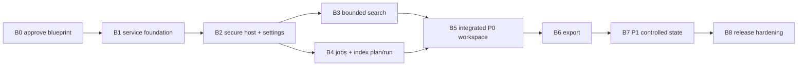

# Local web UI implementation plan

> **Authority:** normative stage gates after Phase 1 approval
> **Volatility:** medium
> **Schedule:** evidence-based sequencing, not a date forecast

Implementation proceeds in reviewable vertical slices. A stage is complete only
when the [status ledger](implementation-status.md) links exact implementation,
tests, operational evidence, documentation, compatibility impact, risks, and
rollback evidence. A page or route without its service and safety contract is
not a completed stage.

Phase 2 in the operator's task concerns agent documentation access and awareness;
it is separate from the implementation stages below and remains gated by
[current work](current-work.md).

## Dependency flow



B3 and the non-mutating parts of B4 may be developed independently only after
B1/B2 contracts exist and file ownership avoids conflicting edits. Acceptance
still requires integrated consistency tests.

## B0 — blueprint approval and baseline

### Entry

- Phase 1 documentation is linked, validated, committed, and reviewed.
- The operator explicitly approves or amends the candidate decisions.
- Phase 2 agent-awareness work, if requested, points agents to the authority
  hierarchy without changing product behavior.

### Work

1. Change accepted decision states from Candidate to Frozen and record date.
2. Reconcile the implementation baseline/version with `pyproject.toml`, current
   CLI parser, source seams, tests, and Codmem recall.
3. Record supported release platforms and browser acceptance matrix.
4. Turn each B1 requirement in the status ledger into an approved small task.

### Exit evidence

- No unresolved conflict among decisions, architecture, contracts, scope,
  status, validation, and manifest.
- Baseline SHA/version and mapped risks are recorded.
- First implementation task names its objective and acceptance contract without
  treating known files as exhaustive scope.

### Rollback

No product code exists. Amend or reject the blueprint while retaining review
history.

## B1 — presentation-neutral service foundation

### Entry

- B0 accepted.
- Current CLI/search/index behavior has focused characterization coverage.

### Work

1. Define shared request/result/warning/error types without FastAPI or Rich
   dependencies.
2. Extract one read-only capability/readiness operation and FTS/regex request
   normalization behind services.
3. Extract index-plan request construction and prove its no-write boundary.
4. Adapt existing CLI paths to the services while retaining terminal rendering,
   exit, export, saved-profile, and pagination behavior.
5. Add a deliberate SQLite read-only connection path that cannot initialize
   schema or directories.
6. Define capability preflight without environment mutation.

### Exit evidence

- CLI/service equivalence for normal, empty, invalid, cached, missing-state, and
  missing-capability cases.
- Source-level and filesystem snapshot proof for read/plan no-write behavior.
- Existing search pagination, search/cache/tag/delete, incremental, ignore, and
  optional-dependency controls pass.
- Base import and CLI work with no web dependencies installed.

### Rollback

CLI adapters can return to their previous internal calls without runtime data
migration. New service modules are additive and contain no durable state.

## B2 — secure host, launch session, and web settings

### Entry

- B1 service types and no-write helpers accepted.
- Dependency/license/security review approves bounded FastAPI/Uvicorn versions.

### Work

1. Add optional `web` dependency metadata and packaged static asset plumbing.
2. Add the foreground `indexly web` launcher with numeric loopback validation,
   ephemeral/fixed port behavior, host-instance lease, browser-open option, and
   bounded graceful shutdown.
3. Implement one-time fragment capability exchange, in-memory session verifier,
   strict cookie, Host/origin enforcement, disabled CORS, security headers,
   redacted request logging, and rate/body limits.
4. Add liveness, readiness, and capability routes with no-write proof.
5. Implement versioned atomic `web-ui.json`, root registration, canonical path
   policy, optimistic concurrency, and malformed-state recovery.
6. Split the prototype into packaged static modules while preserving responsive
   and accessibility behavior; do not wire fictional telemetry.

### Exit evidence

- Cross-origin, DNS-rebinding/Host, missing/replayed launch capability, cookie,
  method, body, and rate-limit tests.
- Non-loopback bind/connect attempts fail across supported platforms.
- Malicious static/indexed fixture content is inert under the CSP and triggers
  no external network request.
- Path matrix covers traversal, casing, Unicode, links/junctions, mount/drive,
  unsupported UNC/device paths, inaccessible/missing/changing targets.
- Wheel and sdist contain assets; base package remains web-independent.
- Start, second-instance conflict, port conflict, browser-open failure, graceful
  shutdown, stale lease, downgrade, and uninstall paths are evidenced.

### Rollback

Uninstall the optional web dependencies and remove the additive web modules and
entry route. Preserve FTS/profile data. Retain or manually remove inert
`web-ui.json` only after documented user choice; never delete registered user
data automatically.

## B3 — bounded FTS and regex search

### Entry

- B1 service extraction and B2 authenticated host accepted.
- Search response/cursor/resource-limit contracts have executable schema tests.

### Work

1. Implement deterministic server-side FTS pagination tied to normalized query
   and `search_index_generation`.
2. Implement separate regex validation and bounded execution with explicit
   truncation.
3. Return plain-text bounded result DTOs, stable error envelopes, opaque
   expiring cursors/search receipts, and safe empty states.
4. Implement Search workspace mode controls, result list, paging, loading/error/
   empty/stale states, and responsive inspector.
5. Retain existing terminal pagination behavior through the CLI adapter.

### Exit evidence

- Boundaries 0/1/page-size/page-size+1/last page; stable ties; invalid/expired/
  tampered/stale cursor cases.
- FTS syntax, filters, sort, fuzzy fallback, NEAR, metadata, tags, snippets,
  cache hit/no-cache/generation behavior match approved parity cases.
- Regex compile, unsupported-field, scan budget, timeout, truncation, context,
  and no-result cases.
- Large-corpus query/result memory and latency budgets recorded on the release
  baseline; no unbounded `fetchall` path remains in the web service.
- Keyboard, screen-reader-name/state, focus, reduced-motion, narrow viewport,
  and malicious-content browser tests pass.

### Rollback

Remove search routes/UI while preserving service characterization and CLI
behavior. No search cursor or receipt is durable across host restart.

## B4 — jobs, index plan, and index run

### Entry

- B1 plan/index service boundary and B2 writer/root infrastructure accepted.
- Cache-coherence and ignore-rule mapped regressions pass on the baseline.

### Work

1. Implement bounded in-memory job state, polling, retention, expiration, safe
   progress observer, cooperative cancellation, and terminal outcomes.
2. Implement the cross-process writer lease and adapt CLI mutations that share
   the same runtime to participate.
3. Implement no-write index plan with normalized scope, ignore precedence,
   candidate/skip/prune evidence, warnings, fingerprint, and expiry.
4. Implement index-run submission with immutable request, revalidation, lease,
   safe progress phases, partial/failure outcomes, and cancellation boundaries.
5. Implement Activity and Indexing Settings states from the prototype using real
   job/capability data only.

### Exit evidence

- Complete job state-transition, retention/expiry, disconnect/reload, request
  replay, cancellation race, terminal-cancel, exception, and shutdown matrix.
- Web/CLI and two-process writer conflicts never overlap mutation or steal a
  live lease; stale-owner recovery is proven.
- Plan snapshots prove no directory/DB/cache/log/profile/settings mutation.
- Full/incremental, new/changed/unchanged, ignored, prune, inaccessible, removed
  during run, optional extraction, partial failure, and retry cases.
- `IDX-03-DEF-001`, `IDX-RISK-002`, and `IDX-RISK-003` controls pass, including
  fresh search after changed/new/pruned indexing.

### Rollback

Stop admission, allow active work to reach a safe boundary, remove routes/UI and
job registry. Writer lease support may remain for safer CLI coordination if it
is independently documented/tested; otherwise remove only after proving no live
owner. Existing index data remains compatible.

## B5 — integrated P0 workspace and health

### Entry

- B2–B4 accepted independently and together.

### Work

1. Integrate Search, Activity, Settings, roots, capability, and health states in
   the single default workspace.
2. Define URL/history/reload behavior and safe recovery from expired session,
   job, cursor, or receipt.
3. Complete status messaging, focus movement/return, responsive navigation,
   inspector resizing, loading/offline/locked/malformed-state cases.
4. Remove or explicitly mark any remaining illustrative prototype control.
5. Add user documentation for install, start, stop, state locations, privacy,
   limitations, and troubleshooting.

### Exit evidence

- End-to-end first-run, missing-index, register-plan-run-search, conflict,
  cancel, restart, and recovery journeys pass on every supported OS/browser.
- No console errors, external requests, inaccessible controls, focus loss,
  color-only status, or horizontal overflow at defined desktop/narrow sizes.
- Health/status routes remain read-only under missing and malformed state.

### Rollback

Feature can be disabled/uninstalled without changing CLI search/index data.
Web settings recovery/removal is documented and never automatic.

## B6 — exact-result export

### Entry

- Search receipts and root path policy accepted through B5.

### Work

1. Define selected-result identity and search-receipt expiry behavior.
2. Add export request/service/job for initially approved formats.
3. Require registered destination, relative output, and fail-if-exists default.
4. Use owned temporary files and atomic completion where supported.
5. Add UI preview of format, selected count, destination, collision rule,
   capability warnings, and completion receipt.

### Exit evidence

- Exact selected set is exported without implicit query re-run.
- Stale/tampered receipt, result changed, path escape, link swap, collision,
  missing PDF extra, disk/access failure, cancellation, temp cleanup, and retry
  cases pass.
- Existing CLI exports remain compatible.

### Rollback

Remove export route/UI. Never remove completed user exports. Clean only proven
owned temporary files after path verification.

## B7 — P1 controlled state

Tags, saved-search profiles, and selected read-only diagnostics are separate
sub-stages. Each needs an approved mini-blueprint and may ship independently.

### Required work

- Tags: exact single/bulk scope, confirmation, cache/search impact, concurrency,
  and CLI equivalence.
- Profiles: versioned schema, backup/migration, atomic writes, locking,
  optimistic concurrency, malformed-state recovery, and saved-result semantics.
- Diagnostics: per-field privacy and no-write proof; no repair, migration,
  clear, dependency mutation, or performance apply.

### Exit and rollback

Each sub-stage links focused automated/browser tests and exercises restoration
of pre-migration data. Failure in one family does not block removal of its UI or
change the others.

## B8 — release hardening

### Entry

- The selected release boundary is implemented and all prior ledgers are current.

### Work and exit evidence

1. Rebuild/install from wheel and sdist in clean environments with and without
   the web extra; verify offline operation and package contents.
2. Exercise upgrade, downgrade, uninstall/reinstall, first run, missing/corrupt
   state, port conflict, locked DB, large corpus, two-process contention,
   browser interruption, and abnormal host termination.
3. Run full regression plus security, privacy, accessibility, cross-platform,
   and performance acceptance in [validation.md](validation.md).
4. Publish support boundary, state/backup guidance, troubleshooting,
   accessibility statement, known limitations, migration, and rollback.
5. Record go/no-go risks and ensure no prototype-only claim appears in release
   documentation.

### Rollback

Remove/disable the additive web command and optional extra while retaining
backward-compatible core runtime data. Restore versioned web settings from the
documented previous copy only after validation; never roll back index state as a
side effect of rolling back the UI.

## Stage report template

Create `delivery/reports/bN-implementation-report.md` only when a stage has
actual evidence:

```markdown
# Stage BN implementation report

Date: **YYYY-MM-DD**
Branch: `codex/...`
Project-Indexly version/SHA: `...`
Blueprint version: `...`
Supported OS/browser/runtime matrix: `...`

## Scope
## Delivered implementation
## Automated evidence
## Browser and accessibility evidence
## Security and privacy evidence
## Runtime, performance, and packaging evidence
## Migration and rollback evidence
## CLI compatibility evidence
## Decision/contract deviations
## Risks and side effects
## Deferred by stage boundary
## Status-ledger updates
```
