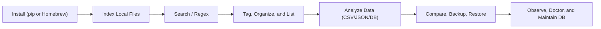

Welcome to the Indexly documentation hub.

Indexly is a local-first CLI for indexing, searching, analyzing, and organizing files without sending your data to external services.

## Documentation Paths

This documentation works best when you enter through the path that matches your goal:

- Everyday CLI path: install, index, search, tag, organize, and back up local content
- Structured data path: analyze CSV, JSON, NDJSON, SQLite, and AutoDoctor artifacts
- Developer path: understand architecture, command wiring, and optional dependency boundaries

## What Is New



  <h4 class="mb-2" style="color:#0f172a;">What changed recently</h4>
  <ul class="mb-3">
    <li>Since `v2.0.2`, NDJSON-style JSON handling and JSON persistence have become more reliable.</li>
    <li>The current analysis stack now documents dedicated AutoDoctor workflows for report JSON, telemetry JSON, and SQLite artifacts.</li>
    <li>`indexly show-help` remains the fastest way to discover command categories before reading deeper guides.</li>
  </ul>
  <a href="/en/releases/" class="btn btn-primary btn-sm me-2">View Release Notes</a>
  <a href="/en/documentation/data-analysis-pipeline/" class="btn btn-outline-secondary btn-sm">Open Analysis Guide</a>



## Start Here

- New user: [Install Indexly](indexly-installation.md)
- Daily workflows: [Usage Guide](usage.md)
- Quick answers: [FAQ](faq.md)
- Structured files and databases: [Data Analysis Overview](data-analysis-overview.md)
- Configuration and filtering: [Configuration](config.md)
- Engineering and contributions: [Developer Guide](developer.md)

## Quick Workflow

## Documentation Map

| Goal | Recommended Page |
| --- | --- |
| Install and verify on Windows, macOS, Linux | [Install Indexly](indexly-installation.md) |
| Learn command workflows end-to-end | [Usage Guide](usage.md) |
| Get short answers for setup, paths, file support, and troubleshooting | [FAQ](faq.md) |
| Choose the right analysis command and pipeline | [Data Analysis Overview](data-analysis-overview.md) |
| Analyze AutoDoctor report JSON, telemetry JSON, or SQLite output | [Analyze AutoDoctor Artifacts](analyze-autodoctor-artifacts.md) |
| Improve indexing quality and ignore rules | [Ignore Rules & Index Hygiene](ignore-rules-index-hygiene.md) |
| Organize folders and inspect logs | [Organizer](organizer.md), [Lister](lister.md) |
| Analyze generic SQLite datasets deeply | [Analyze SQLite Databases](analyze-sqlite-databases.md) |
| Run statistical inference for CSV datasets | [Inference Docs](/inference/) |
| Compare files and folders safely | [File & Folder Comparison](file-folder-comparison.md) |
| Maintain health and schema consistency | [Indexly Doctor](indexly-doctor.md), [DB Migration Utility](db-migration-utility.md) |
| Extend or contribute to the project | [Developer Guide](developer.md) |

## Popular Deep Dives

- [Indexing](indexing.md)
- [Tagging](tagging.md)
- [Analyze AutoDoctor Artifacts](analyze-autodoctor-artifacts.md)
- [Semantic Indexing Overview](semantic-indexing-overview.md)
- [Observers](observers.md)
- [Backup & Restore](backup-restore.md)
- [Time-Series Visualization](time-series-visualization.md)
- [Indexly Logging System](indexly-logging-system.md)

## Cross-Project Notes

Indexly now includes an AutoDoctor documentation subtree under this same Hugo site. That gives you two useful perspectives:

- Use Indexly docs when your goal is: “How do I analyze this artifact with Indexly?”
- Use AutoDoctor docs when your goal is: “What does this artifact mean in the AutoDoctor system?”

Good companion pages:

- [Analyze AutoDoctor Artifacts](analyze-autodoctor-artifacts.md)
- [Telemetry and Persistence](autodoctor/developer-guide/telemetry-and-persistence.md)
- [Generate and Share Support Bundle](autodoctor/getting-started/support-bundle.md)

## Notes For Developers

If you are contributing code, start with:

1. [Developer Guide](developer.md)
2. [Contributing Guide](https://github.com/kimsgent/project-indexly/blob/main/CONTRIBUTING.md)
3. `indexly show-help --details` for parser-level command scope

## License

Indexly is licensed under the [MIT License](LICENSE.txt).
