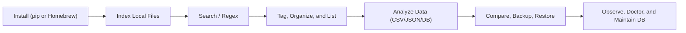

Welcome to the Indexly documentation hub.

Indexly is a local-first CLI for indexing, searching, analyzing, and organizing files without sending your data to external services.

## What Is New



  <h4 class="mb-2" style="color:#0f172a;">What changed recently</h4>
  <ul class="mb-3">
    <li>Lightweight core installation with optional feature packs (`documents`, `analysis`, `visualization`, `pdf_export`).</li>
    <li>Friendlier missing-dependency guidance so users know exactly which extra to install.</li>
    <li>Improved Homebrew and cross-platform installation guidance for macOS, Linux, and Windows.</li>
    <li>Expanded command help structure (`indexly show-help`) with clearer categories and scope hints.</li>
  </ul>
  <a href="/en/releases/" class="btn btn-primary btn-sm me-2">View Release Notes</a>
  <a href="/en/documentation/indexly-installation/" class="btn btn-outline-secondary btn-sm">Open Installation Guide</a>



## Start Here

- New user: [Install Indexly](indexly-installation.md)
- Daily workflows: [Usage Guide](usage.md)
- Configuration and filtering: [Configuration](config.md)
- Engineering and contributions: [Developer Guide](developer.md)

## Quick Workflow

## Documentation Map

| Goal | Recommended Page |
| --- | --- |
| Install and verify on Windows, macOS, Linux | [Install Indexly](indexly-installation.md) |
| Learn command workflows end-to-end | [Usage Guide](usage.md) |
| Improve indexing quality and ignore rules | [Ignore Rules & Index Hygiene](ignore-rules-index-hygiene.md) |
| Organize folders and inspect logs | [Organizer](organizer.md), [Lister](lister.md) |
| Analyze CSV/JSON/XML/SQLite datasets | [Data Analysis Overview](data-analysis-overview.md) |
| Run statistical inference for CSV datasets | [Inference Docs](/inference/) |
| Compare files and folders safely | [File & Folder Comparison](file-folder-comparison.md) |
| Maintain health and schema consistency | [Indexly Doctor](indexly-doctor.md), [DB Migration Utility](db-migration-utility.md) |
| Extend or contribute to the project | [Developer Guide](developer.md) |

## Popular Deep Dives

- [Indexing](indexing.md)
- [Tagging](tagging.md)
- [Semantic Indexing Overview](semantic-indexing-overview.md)
- [Observers](observers.md)
- [Backup & Restore](backup-restore.md)
- [Time-Series Visualization](time-series-visualization.md)
- [Indexly Logging System](indexly-logging-system.md)

## Notes For Developers

If you are contributing code, start with:

1. [Developer Guide](developer.md)
2. [Contributing Guide](https://github.com/kimsgent/project-indexly/blob/main/CONTRIBUTING.md)
3. `indexly show-help --details` for parser-level command scope

## License

Indexly is licensed under the [MIT License](LICENSE.txt).
