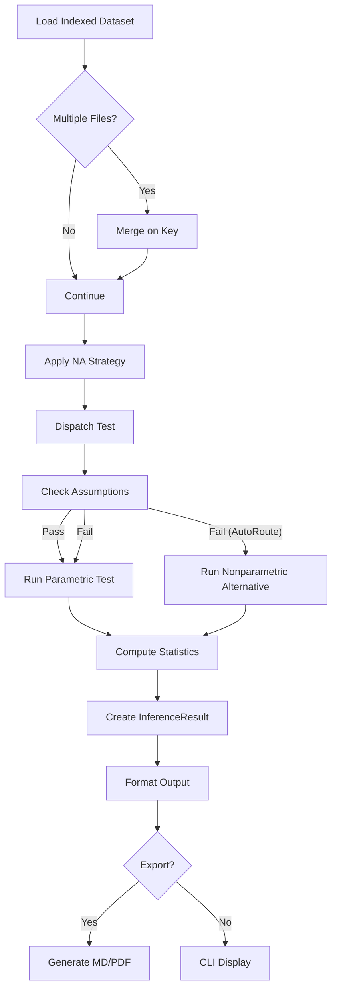

---

# Architecture Overview

The inference engine is modular and deterministic.

**Core layers**

- Loader → dataset retrieval  
- Preprocessing → NA handling  
- Assumptions → statistical validation  
- Dispatcher → pure routing logic  
- Test modules → statistical computation  
- Formatter → console output  
- Exporter → Markdown / PDF generation  

---

## Execution Flow


---

# Example Usage

Run Pearson correlation:

```bash
indexly infer-csv dataset.csv --test correlation --x height --y weight --use-raw
```

Example output:

```text
============================================================
TEST: pearson_correlation
------------------------------------------------------------
Statistic : 0.842193
P-value   : 0.000012
95% CI    : [0.712301, 0.913882]
------------------------------------------------------------
Interpretation:
  Strong positive linear association.
============================================================
```

---

# Design Guarantees

* Always returns a unified `InferenceResult`
* Fisher Z-transform for Pearson CIs
* T-distribution for mean CIs
* Explicit alpha tracking
* No side effects in dispatcher
* Reproducible metadata included

---

# Next

Continue to **[How It Works](how-it-works.md)** to understand:

* Which test to choose
* Required arguments
* Example CLI commands
* Advanced options

