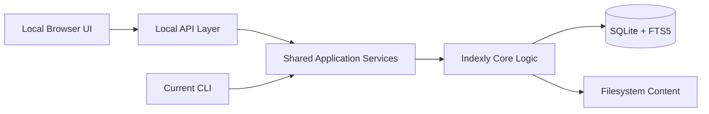

# Indexly Local Web UI: Product and Integration Consideration

## Objective

This document defines a viable future direction for exposing Indexly through a professional local web interface while preserving the existing CLI-first architecture.

The goal is not to replace the terminal workflow, but to make the application accessible to a broader user base: users who are not comfortable with CLI commands but still need the same indexing, search, analysis, and configuration power.

---

## Executive Summary

Indexly is already structured around a strong core of modular capabilities:

- file indexing and scanning
- FTS5 search and regex search
- metadata extraction
- workspace tagging
- CSV/JSON/XML analysis
- export workflows
- watcher and organizer processes
- saved profile configuration

This makes the product a strong candidate for a local web UI, provided that the UI remains a thin presentation layer over the same engine that powers the current CLI.

The recommended principle is:

- CLI remains the canonical automation and power-user interface
- Web UI becomes the guided, human-friendly interface for local use
- both surfaces share the same services and validation logic

---

## Why this direction is realistic

The repo already contains a clean separation between:

- command parsing and user entry via [src/indexly/cli_utils.py](../../cli_utils.py)
- orchestration and feature execution via [src/indexly/indexly.py](../../indexly.py)
- underlying search, indexing, analysis, and metadata modules under [src/indexly](../../)

This is a classic pattern for exposing the same functionality through multiple interfaces without reimplementing the product logic.

In practical terms, the web UI can be added as a service layer instead of a rewrite.

---

## Goals

### Product goals

1. Provide a professional local web experience for users who do not want to work in a terminal.
2. Preserve the current CLI as the primary automation and advanced control surface.
3. Give users a guided configuration experience for broad feature coverage.
4. Keep all operations local-first and avoid any cloud dependency.
5. Support large and complex configuration without overwhelming the user.

### Technical goals

1. Expose the current core logic via a stable API layer.
2. Run long-running tasks asynchronously with visible status and progress.
3. Centralize validation and defaults so CLI and UI remain consistent.
4. Make profiles, tags, searches, and exports reusable across surfaces.
5. Ensure the UI is additive and backward compatible.

---

## Constraints

- keep the current CLI behavior unchanged
- avoid cloud or remote services for core use cases
- maintain local data residency and privacy
- do not duplicate business logic in the UI
- support advanced configuration without exposing a flat, unusable flood of flags

---

## Proposed solution

Implement a local web application that wraps the existing Indexly engine through a structured service layer and API.

---

## What the UI should deliver

### Core capabilities

- index a folder with guided settings
- search full text and regex content
- filter by tag, date, path, file type
- view metadata and snippets in a readable layout
- export results in standard formats
- manage saved profiles and reusable searches
- configure watch tasks and status panels
- run analysis on CSV/JSON/XML and other supported files

### Advanced capabilities

- deep configuration sections for indexing and analysis
- grouped settings by domain instead of a single giant form
- job tracking for long operations
- saved configuration templates
- diagnostic pages for database and status inspection
- optional local desktop packaging later, if desired

---

## Scope of first release

The first viable release should focus on a narrow but highly useful set of actions:

1. Search dashboard
2. Indexing dashboard
3. Results export
4. Saved profiles
5. Background task status
6. Analysis page for CSV/JSON/XML

This creates immediate value without overreaching beyond the project’s current architecture.

---

## Scope of long-term release

The long-term product can include:

- richer watch management
- more advanced analysis visualizations
- deep configuration panels for niche workflows
- local desktop packaging or embedded browser shell
- operational dashboards for DB health and indexing state

---

## Recommended architecture

The web layer should be intentionally thin:

- presentation layer: local browser UI
- API layer: JSON routes for search/index/analyze/export operations
- service layer: adapters around existing logic
- core engine: current indexing/search/analysis modules

This keeps the architecture maintainable and preserves the proven behavior of the CLI.

---

## Delivery Recommendation

### Phase 1 — foundation

- local API exposed on localhost
- status and job handling
- basic search and index pages

### Phase 2 — parity

- profile management
- regex/fuzzy controls
- file/tag filters
- exports

### Phase 3 — analysis and operations

- CSV/JSON/XML analysis workspace
- watch controls
- diagnostics and status views

### Phase 4 — product polish

- improve usability for large result sets
- add advanced grouped configuration panels
- improve task progress and diagnostics

---

## Conclusion

This direction is both realistic and strategically sound. Indexly already has the right core architecture to support a professional local web experience without abandoning the CLI-first design.

The key to success is not to rewrite the app around the UI, but to expose the current engine behind a clean, local web interface.

---

## Related design files

- [architecture.md](architecture.md)
- [feature-parity.md](feature-parity.md)
- [roadmap.md](roadmap.md)
