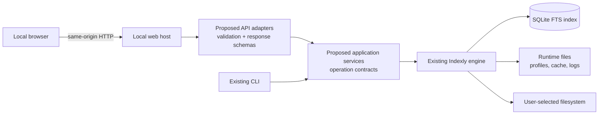

# Indexly local web UI — investigation v2

> **State:** v2 investigation, not an approved implementation blueprint.
> **Scope:** a local, single-user browser experience for the existing Indexly
> engine. No web framework, server, or CLI behavior is introduced here.

## Purpose and correction to v1

Version 1 established that a local web UI is credible. This revision makes that
direction reviewable: it separates verified repository evidence from proposed
architecture, identifies implementation gaps and safety invariants, and links
the future blueprint to the source it must preserve.

The core conclusion remains: **the UI must be another client of Indexly
application services, never a second implementation of Indexly behavior.**

There is one material correction. Indexly has reusable modules, but it does
**not** yet have the `SearchService` / `IndexService` boundary imagined in v1.
The parser in [`cli_utils.py`](../../cli_utils.py) dispatches to handlers in
[`indexly.py`](../../indexly.py); several handlers expect an
`argparse.Namespace` and render terminal output. A web API must first gain a
small, tested application-service layer. It must not shell out to `indexly` and
scrape Rich or terminal text.

## Evidence labels

| Label | Meaning |
| --- | --- |
| **Verified** | Directly evidenced by current repository code, tests, or published documentation. |
| **Required** | A non-negotiable property for a safe local UI implementation. |
| **Proposed** | A direction for the later blueprint, not current code or public API. |
| **Decision needed** | An intentionally unresolved choice that the blueprint must settle. |

## Verified present state

- The public executable enters via [`__main__.py`](../../__main__.py), then
  [`indexly.main`](../../indexly.py); command grammar is in
  [`cli_utils.py`](../../cli_utils.py).
- FTS and regex search are in [`search_core.py`](../../search_core.py). Search
  cache validity uses `search_index_generation` in
  [`db_utils.py`](../../db_utils.py), which indexing updates after effective
  changes or pruning.
- `scan_and_index_files` is asynchronous internally, but
  `handle_index` is a synchronous CLI handler in
  [`indexly.py`](../../indexly.py).
- Profiles are JSON-backed through [`profiles.py`](../../profiles.py); exports
  write files through [`export_utils.py`](../../export_utils.py).
- The FTS database, cache, profiles, and logs are local runtime files defined
  by [`config.py`](../../config.py) and [`runtime_paths.py`](../../runtime_paths.py).
- Optional capabilities are lazy and supply user-actionable missing-extra
  guidance; see [`optional_deps.py`](../../optional_deps.py),
  [`cli_utils.py`](../../cli_utils.py), and [`pyproject.toml`](../../../../pyproject.toml).
- `watch` and `rename-watch` are separate families. The latter owns locking and
  durable recovery logic under [`rename_watch/`](../../rename_watch/) and is
  not a simple start/stop feature.

## Proposed layering

The browser owns rendering and interaction state. API adapters own
HTTP-specific input limits, local access protection, and error envelopes.
Application services own normalized requests, operation policy, structured
results, and calls to the engine. Existing modules retain domain behavior.

## Product boundary

The first product is a **loopback-only companion**, not a LAN service,
multi-user product, remote filesystem gateway, or cloud synchronization client.
"Local" is not authorization: local processes and hostile browser origins can
still attempt requests. Filesystem paths, result content, metadata, and tags
are untrusted input; validation and output encoding belong at the service/API
boundary, not only in forms.

The implementation must preserve a strict distinction between read-only,
index-state writing, new-file writing, and filesystem-mutating operations.
The latter (organize, rename, restore, recovery) are out of the initial UI
scope pending explicit plan/confirmation/rollback and audit contracts.

## How to use this investigation

1. Approve the operating envelope and invariants in
   [architecture.md](architecture.md).
2. Use [reference-map.md](reference-map.md) to write an adapter backlog around
   current source and tests without drifting from CLI behavior.
3. Select a stack only after recording the web-host topology, local access
   model, static asset delivery, packaging, and lifecycle decision.
4. Agree the release boundary in [feature-parity.md](feature-parity.md).
5. Use [roadmap.md](roadmap.md) as evidence gates rather than calendar promises.

## Document set

- [architecture.md](architecture.md) — boundaries, contracts, state, safety,
  concurrency, and open decisions.
- [feature-parity.md](feature-parity.md) — command inventory, release scope,
  write classification, and parity acceptance criteria.
- [reference-map.md](reference-map.md) — code, tests, existing user docs, and
  external engineering references.
- [roadmap.md](roadmap.md) — phased delivery gates and completion evidence.

## Deliberately undecided

This investigation does not choose a web/frontend framework or desktop wrapper,
the job persistence model, profile migration/versioning, destructive-utility
admission, release packaging, or public compatibility guarantee. The later
blueprint must make those decisions with alternatives, tests, migration and
rollback behavior, and explicit owners.
