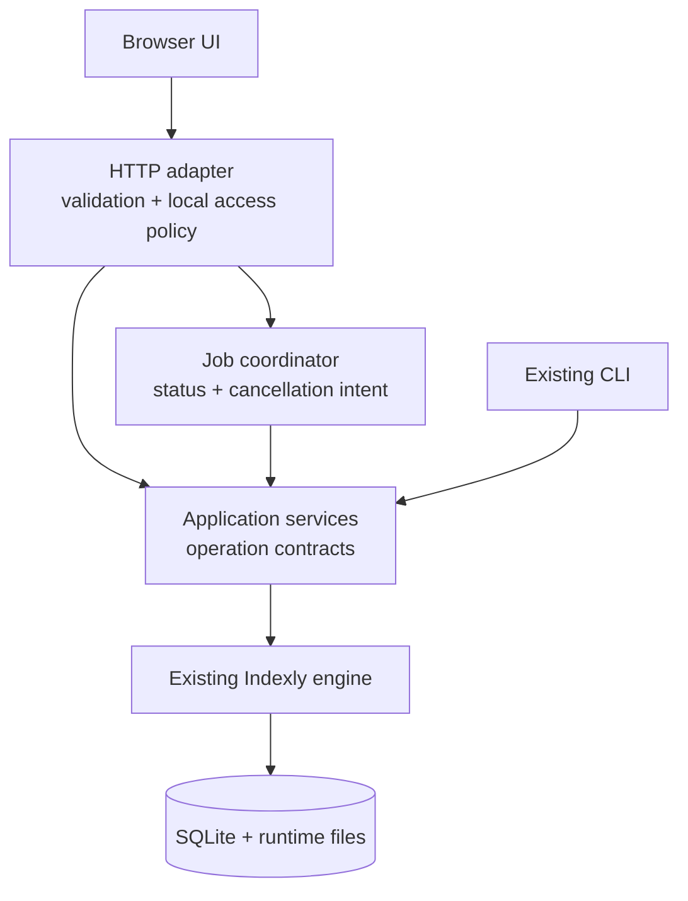
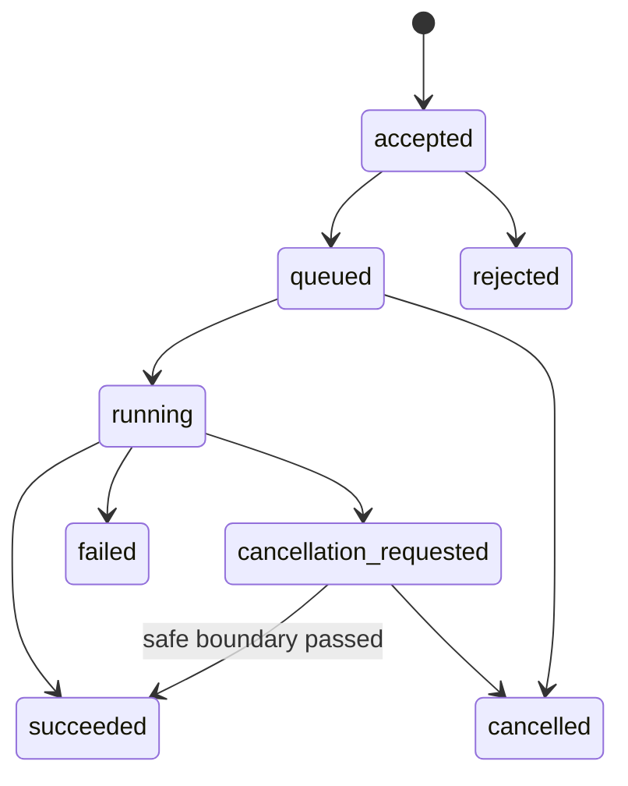

# Local web UI architecture and operating envelope

> **State:** v2 investigation. Service and API names describe required future
> boundaries; they are not present code or public API.

## Decision to carry forward

**Required:** preserve the CLI and introduce structured application services
before adding browser transport. Do not turn `argparse.Namespace`, console
output, `print`, `SystemExit`, or subprocess calls into the web contract.

Today [`cli_utils.py`](../../cli_utils.py) dispatches direct handlers in
[`indexly.py`](../../indexly.py). `handle_index`, `handle_search`, and
`handle_regex` combine orchestration with terminal presentation. The later
blueprint must extract typed operation functions returning structured results,
warnings, and domain errors; CLI handlers and API adapters should use them.
The public entry point has early perf and rename-watch-status routing in
[`__main__.py`](../../__main__.py), so a web launcher must not reuse CLI
dispatch blindly.



| Layer | Owns | Must not own |
| --- | --- | --- |
| Browser | Rendering, accessibility, interaction state, cancellation request. | Authoritative validation, authorization, filesystem policy, raw HTML rendering. |
| HTTP adapter | Schema/body limits, local access checks, IDs, stable error envelope. | SQLite access, CLI-text parsing, domain decisions, raw traceback disclosure. |
| Application service | Normalized request, operation policy, engine call, DTO/result/event. | HTTP/DOM framework coupling or expanded path scope. |
| Existing engine | Index/search/analysis/extraction and persistence behavior. | Web framework details. |

## Contract before routes

Define versioned request/result models before routes:

```text
Request:  request_id, operation, schema_version, validated payload,
          foreground/background execution preference
Response: request_id, operation, schema_version, outcome,
          data, warnings[], stable error code/message/field violations
Job:      job_id, immutable request, state, timestamps, progress, result/error
```

`202 Accepted` means a job has been registered and can be read—not that work
succeeded. IDs and page tokens must be opaque and bounded. Required error
categories include `invalid_request`, `missing_optional_dependency`,
`unavailable_external_tool`, `not_found`, `conflict`, `cancelled`, `failed`, and
`internal_error`. Preserve the action-oriented optional-extra messages from
[`optional_deps.py`](../../optional_deps.py), not a generic 500 response.

## Local access, privacy, and paths

**Required envelope:** loopback-only default binding, same-origin static UI/API,
no permissive CORS, and one local user/runtime. Any LAN/remote mode is a
separate product with a threat model, authentication, TLS, and support boundary.
[CORS](https://developer.mozilla.org/en-US/docs/Web/HTTP/Guides/CORS) is browser
access control, not authentication.

The blueprint must choose and test a local-launch protection mechanism, reject
unexpected Host/origin requests, and set a restrictive CSP. Filename, content,
metadata, tags, analyzer output, cache, profiles, and logs are untrusted input;
encode them contextually and never inject result content as HTML.

Treat every filesystem path as hostile until service-layer policy accepts it.
Document canonicalization and post-resolution allowed-root checks, symlink /
junction / mount behavior, casing and Unicode rules, inaccessible paths, and
files that change during work. Form validation or a browser picker is not
server-side authorization.

| Class | Examples | Initial UI policy |
| --- | --- | --- |
| Read-only | Search, stats, doctor read checks. | Bounded direct operation; prove it does not create/migrate state. |
| Index-state write | Index, tags, profiles, cache clear. | Show scope/effects and serialize conflicts. |
| New-file write | Export, analysis artifact. | Explicit destination and collision/overwrite policy. |
| Filesystem-mutating | Organize, rename, restore, recovery. | Out of scope pending plan, confirmation, audit, and rollback evidence. |

## Concurrency, jobs, and cancellation

Indexly writes SQLite and runtime files. SQLite locking needs intentional
coordination; see [SQLite locking](https://www.sqlite.org/lockingv3.html).
Current indexing uses async tasks with a process-local lock and direct RW
connections. It has no general cross-process job queue, writer lease,
idempotency key, cancellation, retention, or event protocol.

Start with one mutating job per runtime database, define read-during-write
behavior, and surface conflicts/timeouts. Preserve `search_index_generation`:
after indexing changes or prunes a root, the next FTS query must not return a
stale UI/API cache result. This retains the current freshness behavior in
[`search_core.py`](../../search_core.py) and [`db_utils.py`](../../db_utils.py).



- Progress is an observation (phase, safe counts, message, timestamps), not an
  invented percentage. The current index path has no general progress API.
- "Cancel" means *requested* until a worker acknowledges a safe boundary. Do
  not kill a thread holding SQLite/files. Browser
  [AbortController](https://developer.mozilla.org/en-US/docs/Web/API/AbortController)
  cancellation only ends the HTTP wait, not necessarily the job.
- `--plan` remains non-mutating, including not creating a database. A read route
  must not casually call `connect_db`, since regular connections initialize
  schema/directories.

## Runtime state is not one database

| Domain | Current evidence | Blueprint decision |
| --- | --- | --- |
| Search runtime | FTS DB, cache, profiles, logs via [`runtime_paths.py`](../../runtime_paths.py) / [`config.py`](../../config.py). | Ownership, read-only path, cache, retention/redaction. |
| Search schema | FTS, tags, metadata, `indexly_state` in [`db_utils.py`](../../db_utils.py). | Writer coordination, migration, status/reporting. |
| Analysis state | Separate DB/datasets/artifacts through `analysis_orchestrator` and [`datasets/`](../../datasets/). | Persisted versus ephemeral analysis/artifact UX. |
| Profiles | Plain JSON in [`profiles.py`](../../profiles.py), only saved-search semantics. | Schema/migration, atomicity and multi-tab conflict behavior. |
| Job history | No general web-job store. | In-memory versus durable history and restart/retention semantics. |

## Observability and accessibility

Correlate request, job, and local log records with an ID. Record operation,
safe scope summary, timing, counts, outcome, and error code—not indexed content
or full result data by default. Diagnostics cannot become a content-exfiltration
surface. Support keyboard operation, semantic labels, focus, announced state,
non-color-only status, server-side pagination, and bounded large-result
rendering. FTS and regex have distinct contracts; do not expose controls one
mode cannot honor.

## Decisions the future blueprint must close

1. Web/frontend stack, launcher lifecycle, static assets, packaging, upgrade.
   [FastAPI concurrency guidance](https://fastapi.tiangolo.com/async/) is a
   reference, not a selection.
2. Local launch secret/origin/Host policy and failure recovery.
3. Job/writer model, cancellation boundary, restart and read-during-write.
4. Root-registration/path UX and platform-specific canonicalization.
5. Profile/job persistence, migration, conflict, and rollback behavior.
6. Admission criteria for watcher, diagnostics, performance, artifacts, and all
   filesystem-mutating commands.
