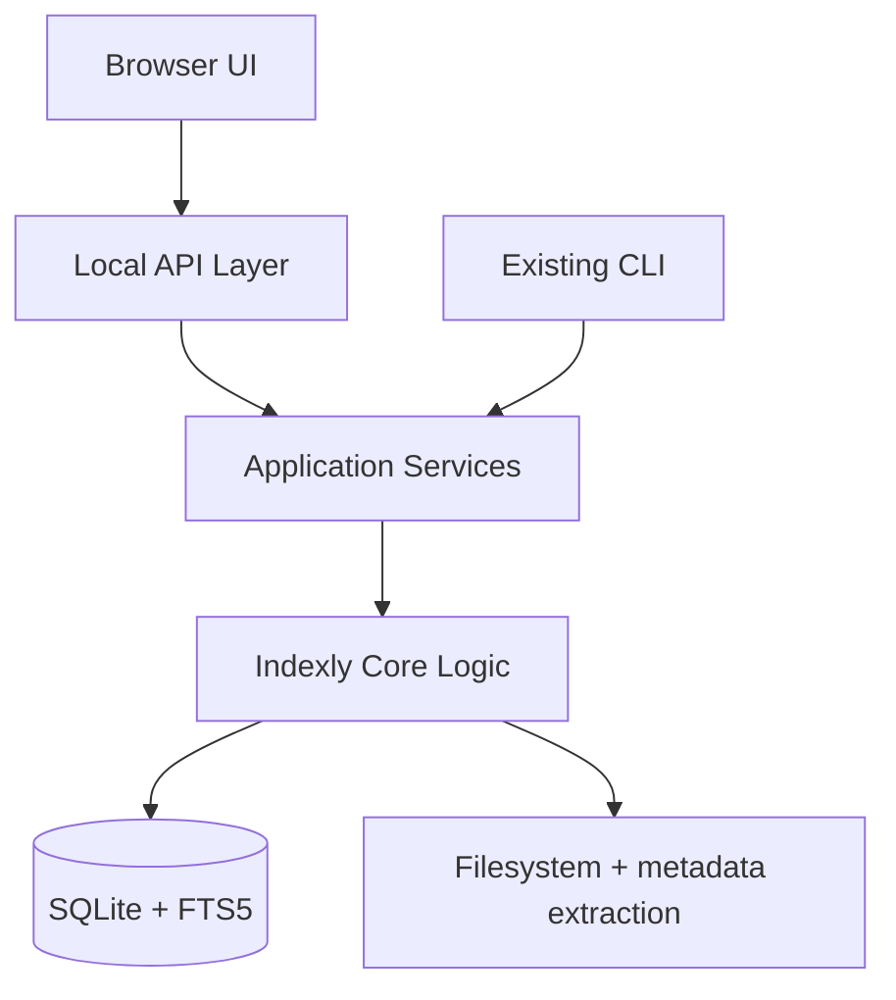

# Local Web UI Architecture

## Summary

The Indexly web UI should be designed as a presentation layer over the same core engine that drives the current terminal-based product. The CLI remains the authoritative execution path for automation and advanced workflows, while the web app provides a more guided local interface for broader usage.

---

## Architectural model



---

## Layer responsibilities

### 1. Browser UI

Handles:

- search form and result display
- indexing controls
- file analysis workspace
- profile and settings management
- progress and status notifications

### 2. API layer

Responsible for:

- validating user input
- translating UI requests into core actions
- returning structured JSON results
- exposing job status and progress endpoints

### 3. Service layer

Thin, orchestrating services such as:

- `SearchService`
- `IndexService`
- `AnalysisService`
- `ProfileService`
- `TagService`
- `WatchService`

These services call existing CLI and library functions rather than duplicating logic.

### 4. Core Indexly engine

This remains the real implementation layer:

- metadata and text extraction
- indexing algorithms
- FTS5 and regex search
- CSV/JSON/XML analysis
- saved profiles and export logic

---

## Recommended service interfaces

```python
class SearchService:
    def search_fts(self, *, term, filters, sort_by, context, page, page_size):
        ...

    def search_regex(self, *, pattern, filters, context):
        ...

    def export_results(self, *, results, export_format, output_path=None):
        ...
```

```python
class IndexService:
    def run_index(self, *, folder, filetype=None, only_changes=False, plan=False):
        ...

    def preview_index_plan(self, *, folder, filetype=None):
        ...
```

```python
class AnalysisService:
    def analyze_file(self, *, path, file_type=None, options=None):
        ...
```

---

## Job model

Long-running operations should not block the browser UI.

Recommended model:

- enqueue job with unique `job_id`
- run in background thread or worker process
- return immediate status response
- allow polling for progress and completion

Example statuses:

- queued
- running
- completed
- failed
- cancelled

---

## Consequences of this design

### Benefits

- no rewrite of the search/index engine
- one implementation source of truth
- shared validation and behavior between CLI and UI
- easier future expansion into local desktop packaging or browser wrappers

### Risks to manage

- accidental duplication of logic in the UI layer
- unbounded long-running jobs without status tracking
- config drift between CLI and web forms

Mitigation: centralize validation and default values in shared service schemas.

---

## Delivery recommendation

The first release should include only the minimal but essential flow:

- Search
- Index
- Results export
- Background jobs
- Saved profiles
- Analysis for common file types

This is sufficient to prove the integration model without converting the project into a different product category.
